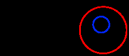
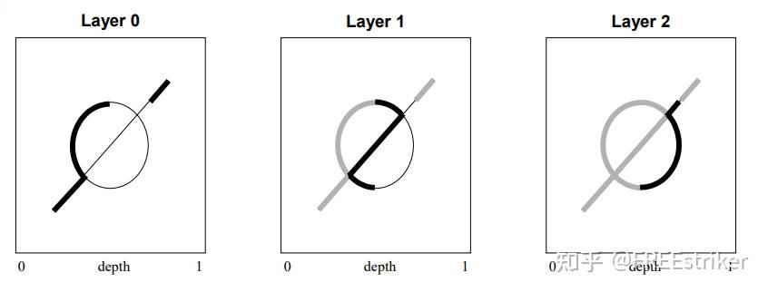

# 背景知识
<!-- 透明渲染的难点，可能会遇到的问题，比如渲染错误，性能问题 -->


透明是一种重要的渲染效果，能显著提升场景的真实感和可视化系统的效率。然而，透明渲染却存在挑战。其基础是混合（Blending），这涉及简单的几何处理，却无需考虑显示世界中的各种问题。处理透明渲染时需要考虑到硬件问题，因此渲染本身是一个复杂的任务

没有像透明像素的深度缓冲区那样的缓冲区来告诉图形库哪些像素是完全可见的或半可见的。原因之一可能是，没有有效的方法将透明像素的信息存储在这样的缓冲区中，该缓冲区可以为屏幕上的每个坐标容纳无限数量的像素。由于每个透明像素都可能暴露其底层像素，因此需要有一种方法来存储所有屏幕坐标的所有像素的不同层。

在不需要处理透明的过程中，OpenGL 提供了一个深度缓存（Depth Buffer），通过这个缓存器，对需要绘制的不
透明 3D 物件，可以很简单的实现隐藏表面的剔除。

可视如果考虑到透明的对象物体,这个时候只考虑缓存然后渲染最前面的对象就不足以支持复杂的真实世界

这个时候就需要考虑使用到一些算法来进行优化,提升渲染性能可渲染的正确性,下面介绍了一些在渲染透明物体中可能用到的知识


## 实现透明渲染的算法
* 基于 CPU 的排序的透明渲染，
* 深度剥离
* 双层深度剥离
* 透明权重和透明平均权重
* 还有基于 GPU 排序的无序透明渲染

## blending 技术
透明渲染是可以通过OpenGL 的自身特性进行简单实现的，

对于透明物件的渲染，OpenGL 提供了 Alpha-Blending 技术来实现，然而，对于复
杂的不透明与透明物体共存的需求，单一的深度缓存跟 Alpha-Blending 并不能解决问
题

但是这种渲染技术存在一定的问题，他渲染的结果只是近似值，并不是精确的结果

## 常见的解决思路

1. 深度缓冲

OpenGL 提供了一个深度缓存（Depth Buffer），通过这个缓存器，对需要绘制的不
透明 3D 物件，可以很简单的实现隐藏表面的剔除。

然而，遗憾的是，单一的深度缓存并不能解决透明物体的渲染问题，应该
一个透明物体不仅要被在它之前的不透明物件所遮挡，又不能档着它之后的其他物
件。

2. 画家算法
如果对场景中的所有物体进行排序，那我们就可以先画远处的，再画近处的，这样就可以确保前面例子中的 B 可以在 A 之前绘制，画家算法就是基于这种思路的解决方法。

但是他存在两个问题，一个就是最基础的性能问题，需要把所有的图形都渲染出来，然后再让前面的渲染结果覆盖后面的结果,相当于后面的渲染内容其实是无效的渲染结果,根本就没有体现在用户的窗口中

还有一种情况及时发生交叉情况，显示情况中物体之间不是简单的分离的状态，各种状态是叠加的如图:


如果 A 是个玻璃杯而 B 是它里面的一个玻璃球时就是这种情况了。现在我们就没
法对它们进行排序了，因为 A 的一部分比 B 近，而另一部分又比 B 远。
在这里我们注意到，题目的要求中需要对透明交叉的物体进行渲染，这里就需要注意到不能通过简单的深度缓冲和画家算法进行绘制,
为此就有了新的算法方案,也就是深度剥离算法,用来保证渲染的正确性.

# 算法描述
深度剥离算法
在介绍这个算法之前不得不介绍一下加权平均值算法，这是一种用简单的透明混合公式来实现无序透明渲染的算法，但是他的计算结果只和透明对象的混合个数，颜色，和透明有关，和对观察点的距离无关，虽然渲染的速度很快，但是其实渲染结果只是一个近似值，不是精确值，题干要求正确渲染，所以这种方法不能使用.

作为优化，替代的方法就是深度剥离算法

这是 是一种对深度值进行排序的技术

标准的深度检测使场景中 Z 值最小的点输出到屏幕上，也就是离我们最近的顶点。但
还有离我们第二近的顶点，第三近的顶点存在。要想显示它们，可以用多遍渲染的方
法。在第一遍渲染时，按正常方式处理，这样就得到了离我们最近的表面中每个顶点
的 Z 值；在第二遍渲染时，把现在每个顶点的深度值和刚才的那个深度值进行比较，
凡是小于等于第一遍得到的 Z 值，把它们剥离，后面的过程依此类推即可

可以从这张图上看出基本处理原理


每一遍需要使用到α混合，也就是透明度混合，使用如下的公式


$$
Cdst =Asrc Csrc+(1-Asrc) Cdst
$$


混合公式展开后如下

$$
&\text{C1'} =\mathrm{A1~C1~+~(1-A1)~C0}  \\
&\text{C2'} \mathrm{=A2~C2+(1-A2)~C1}，  \\
&\text{C2'} =\text{A2 C2}+\left(1-\text{A2}\right)\left(\text{Al Cl}+\left(1-\text{Al}\right)\text{C0}\right)  \\
&\text{C2'} =\text{A2 C2}+\text{(1-A2) A1 C1}+\text{(1-A2) (1-A1) C0} 
$$


# 实现细节
1. 准备相机类，用于动态处理视角变化，确保渲染结果的一致性和准确性
2. 准备glfw，初始化相关变量，用于 窗口管理、上下文创建以及输入事件处理
``` cpp
    glfwInit();
    glfwWindowHint(GLFW_CONTEXT_VERSION_MAJOR， 3);
    glfwWindowHint(GLFW_CONTEXT_VERSION_MINOR， 3);
    glfwWindowHint(GLFW_OPENGL_PROFILE， GLFW_OPENGL_CORE_PROFILE);

    GLFWwindow* window = glfwCreateWindow(SCR_WIDTH， SCR_HEIGHT， "dianyuluo"， NULL， NULL);
    if (window == NULL)
    {
        std::cout << "Failed to create GLFW window" << std::endl;
        glfwTerminate();
        return -1;
    }
    // 修改的是改变windows 指针指向的内容
    // 渲染内容指向这里
    glfwMakeContextCurrent(window);
    // tell GLFW to capture our mouse
    glfwSetInputMode(window， GLFW_CURSOR， GLFW_CURSOR_DISABLED);
```
3. 清除缓冲区的颜色和深度
4. 通过片断处理器将 z 变成(2-z，z)两个值，然后将它们保存到颜色渲染目标。
5. 剥离-混合 这一阶段是整个算法的核心部分，它负责将所以的颜色层每次两层两层的剥离出来，并分别将前后两层分别与之后的前后层结果将正确的混合方程混合起来，这部分的代码通过着色器实现
6. 合并两个剥离层的结果，片段着色器代码如下
   ``` glsl
      uniform vec4
   viewport;"//viewport
   uniform sampler2D
   tex0;//==>background color
   uniform sampler2D
   tex1;//==>blend result
   void main(void)
   {
   vec2
   texCoord = (gl_FragCoord.xy - viewport.xy) / viewport.zw;
   vec4
   bkColor = texture2D(tex0， texCoord);
   vec4
   resColor = texture2D(tex1， texCoord);
   float
   destAlpha = 1.0 - resColor.a;
   gl_FragColor = vec4(bkColor.rgb * destAlpha + resColor.rgb， 1.0 - (1.0 - bkColor.a) *
   destAlpha);
   }
   ```
7. 离屏渲染
8. 从步骤3开始重复

# 测试
## 性能测试
OpenGL 提供一系列的接口来进行测试图形计算所有的时间

``` cpp
 start_the_clock () ; 
 draw_a_bunch_of_polygons () ;
 stop_the_clock () ;
 swapbuffers () ;
```
在固定测试环境的情况下，

测试环境 如下

 * cpu： Intel(R)Core(TM) i5-7300HQ CPU @ 2.50GHZ
 * gpu: NVIDIA GeForce GTX 1050 Ti
 * 内存: 16G
 * 操作系统: windows10 64bit
 * OpenGL : 3.1

测试生成一帧所用的时间和一般的算法所用的时间进行对比，

| 三角形个数(个) | 旧方法计算时间(s) | 深度剥离算法计算时间 (s)|
|------------|----------------|----------------------|
|            |                |                      |
|            |                |                      |
|            |                |                      |

## 正确性测试
模拟实验证明，可以通过模拟和实验来验证算法的正确性。这包括使用不同的输入数据、边界条件和情况来测试算法的表现.

# 优化的部分
   1. 剪裁窗口，只渲染我们需要的内容，用于自定义剪裁框以将3D视图显示限制为3D空间的一部分。可以帮助处理复杂的模型和场景。
在本项目中，摄像机变量就完成了可视区域的处理，能够集中处理用户可以看见的区域，不去渲染用户用不到的区域
   2. Level Of Detail， 一种处理的思路，处理重点的区域，部分地区可以减少甚至不渲染，进行模糊处理
   3. 应用缓冲区，提高并行度和性能，以提高内存访问效率
# 总结
1. 更新的技术
   * 事实上再透明物体的渲染上还有更好的解决办法，有更新的处理方案，例如Per-Pixel-Linked-List算法，但是由于硬件支持和算法本身的难度问题上，实现比较困难


# 参考文献
[1]吴岱衡. 基于OpenGL开发的无序透明渲染[D].华南理工大学，2013.
[2]毛华庆. 基于GPU优化的三维实时渲染技术的研究[D].武汉大学，2010.
[3]吴博剑. 基于图像的透明物体重建与渲染[D].中国科学院大学2019.
[4]李海梅. 基于CUDA的透明物体的实时渲染[D].上海交通大学，2014.


透明渲染介绍
https://learnopengl.com/Guest-Articles/2020/OIT/Introduction

权重混合 
https://jcgt.org/published/0002/02/09/

深度剥离算法
https://developer.download.nvidia.com/assets/gamedev/docs/OrderIndependentTransparency.pdf

对应的视频
https://www.youtube.com/watch?v=a9ZUzu6sII0

