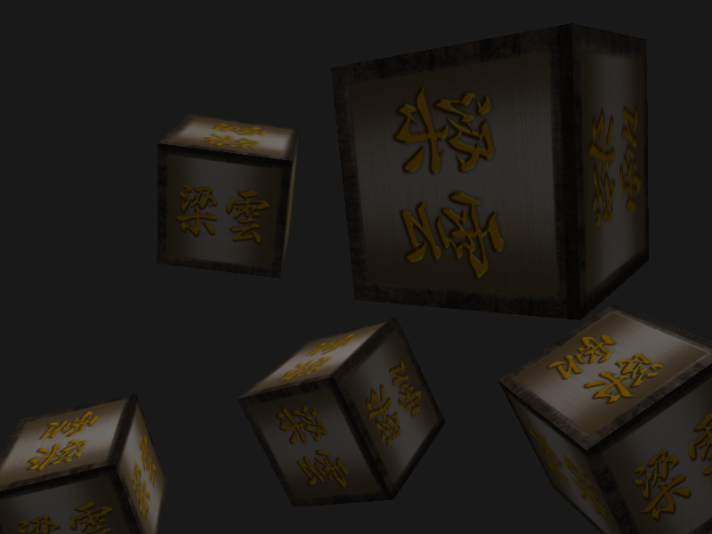

# 面试报告

## 时间安排

第一天: 阅读问题,评估项目的可行性,技术选型

第二天: 在项目中成功引入需要用到的第三方库,能够基本绘制图形

第三天: 参考并拉取成熟的代码方案,运行成功

第四天: 阅读代码逻辑

第五天: 理清数学原理,开始构建项目报告文档并提交

## 解决方案概述

### 项目假设

首先先简化问题,问题的考虑都是从个例到一般的,先把情况向最简单的情况进行考量

1. 先进行不透明渲染,进行对象的完全遮挡,在后续的程序的优化中把透明的逻辑再插入程序中(我猜测不会对程序进行大规模的改动)
2. 默认所有的对象都是半透明的

### 过程概述

建立深度缓冲区和色彩缓冲区,用着色器来进行计算,着色器的输入值是缓冲区的颜色和对应的深度,来计算数据的结果

然后开始建立了两个自定义的类,一个用来进行shader的管理,另一个用来控制视角的变换,方便的让视角和图像的处理进行分离开

### 深度处理机制

深度处理机制用的是OpenGL 提供的api ,这个部分不需要我手动的进行管理,但是经过相关知识点的查阅,能够给出相关的处理原理

是深度缓冲和深度测试两个部分

缓冲是开辟一篇空间保存像素的深度值,测试是对缓冲中的深度值进行比对,然后选择哪个点的像素进行渲染

如果不进行这个部分,默认情况下开启的渲染就是从无到有,从前往后的渲染方式,这样导致的一个结果就是有可能后面的渲染的内容就遮挡了前面的内容

所以需要通过计算像素节点的深度值,这个值在世界坐标下经过转换转到到用户坐标,对应的就是深度,这个值可以保存到深度缓冲区中,然后再着色器的工作中处理掉,计算是否要渲染出来

虽然说了这么多,glad 的库帮我们完成了这些工作,我们需要的是正确的调用这些库

glEnable(GL_DEPTH_TEST);

然后就是把着色器附着到缓冲区上,让他们之间产生联系
### 动态视角适应性

额外定义照相机的类,然后让照相机的处理机制和shader联系在一起处理.

首先相机需要定制一写属性,有关欧拉角的两个基础属性  float Yaw;    float Pitch;
最开始的时候指定相机的坐标,通过两个属性来计算相机的欧拉角也就是相机的朝向

相机的方向属性,相机就是视角,

视角还要处理一下移动操作,这些操作只需要更改和相机的成员变量即可,不需要直接对视角和对象的信息进行操作,通过更改相机变量,后面相机会和着色器进行相关联,每一个管线都会和相机输入的内容进行处理,然后就能获得3维实体转2维图像的结果

相机会根据属性获得观察视角,然后对视角进行处理,

相机的属性

相机接收的数据是相关的移动操作,比如,前后左右,放大,缩小,上下是被固定的,在接收这些操作之后,相机会改变自己的位置信息,上,前,右(也就是一个三维坐标),还有偏航角, 俯仰角

他可以根据这些信息获得视图矩阵,视图矩阵的应用,也就是可以将物体坐标转换到相机空间

简单的说就是把一个绝对的坐标系中的位置转换成相对的(也就是用户眼中的位置坐标系),这个东西可以进行矩阵运算,这个部分是依赖glm 库完成的,但是其内在原理的数学公式如下

$$
\text{view matrix} = 
\begin{bmatrix}
    \text{right.x} & \text{right.y} & \text{right.z} & 0 \\
    \text{up.x} & \text{up.y} & \text{up.z} & 0 \\
    -\text{front.x} & -\text{front.y} & -\text{front.z} & 0 \\
    0 & 0 & 0 & 1
\end{bmatrix}
$$

其中，$\text{right} = \frac{\text{cross(Up, Front)}}{\|\text{cross(Up, Front)}\|}$，$\text{up} = \frac{\text{cross(Front, right)}}{\|\text{cross(Front, right)}\|}$。这样生成的观察矩阵可以将世界坐标系中的物体转换到相机坐标系中。

然后通过 
glm::perspective 获得相机视角的投影矩阵(数学公式不写了,我看不明白)

这样就从数学角度上保证了相机的稳定性

简单的说就是照相机他只需要提供两个矩阵就可以了,一个视图矩阵, 投影矩阵,用来辅助运算,(线性代数不想扣了)

### 性能优化策略

性能主要还是靠着显卡的优势进行数据的计算获得一个最终的结果,而且我直接参考的成熟的代码方案,没有一个自己的优化方案,我只能查阅别人是怎么优化的

优化的一个核心观点就是避免不必要的计算和优化算法,

在本项目中采用的优化方案是:
1. 采用着色器,让显卡完成辅助计算
2. 只渲染可见部分，裁剪不可见的对象或区域，避免不必要的绘制操作
   使用     glfwSetFramebufferSizeCallback(window, framebuffer_size_callback);给对应的hook定制Callback 函数

### 方案实施细节

具体详细的细节可以直接查看项目中的 src/main.cpp 源代码,有这具体的代码实现和注释,

但是为了方便理解,下面是代码的伪代码实现和具体的流程和逻辑的介绍,注意,下面的代码省略了和准备各种基本变量的过程,包括着色器的定义,正方体顶点位置的准备,顶点和片元着色器如何产生联系,图片的载入等等准备信息,直接进入渲染循环,也就是 loop 中介绍渲染的过程

1. 获得键盘输入(用于进行视角的转换 )
2. 清楚缓冲区的颜色和深度
3. 修改修改着色器的输入内容,包括视角的位置,环境光,漫反射,镜面反射的设置
4. 通过相机的信息创建投影矩阵,用于坐标的变换
5. 同理获得相机的数据矩阵
6. 世界矩阵(固定的坐标),创建
7. 把所有的对象坐标,进行旋转,旋转之后进行绘制(注意需要再下一个循环应用着色器,不能再本次循环结尾使用)
8. 交换缓冲,获得下一次键盘操作,然后重复操作1 

### 测试案例

执行代码,然后查看cpu 和显卡的占用率,显然,能够满足实时渲染,视角追踪的需求

测试结果如图,完成了对象的深度检测,但是透明不是很好处理,未完成

---------------------------

## 项目总结

### 项目亮点
1. 思路清晰:在没有图形学基础的情况下快速搭建平台,并成功编译项目,并在次基础上不断的进行优化,符合敏捷开发的软件工程思路.
2. 使用cmake进行项目构建: 保证代码的在不同用户的电脑上都可以编译,构建(后续可能会修改让代码可以跨平台运行)
3. git进行项目管理:Git提供了强大的版本控制功能，可以轻松跟踪项目文件的变化历史，包括修改内容、作者和时间等信息。

### 缺点和不足

1. 缺少和需求方的紧密沟通
2. 代码的编译结果无法再不同电脑上分发,可能需要用户自主安装运行库 https://aka.ms/vs/17/release/vc_redist.x64.exe

